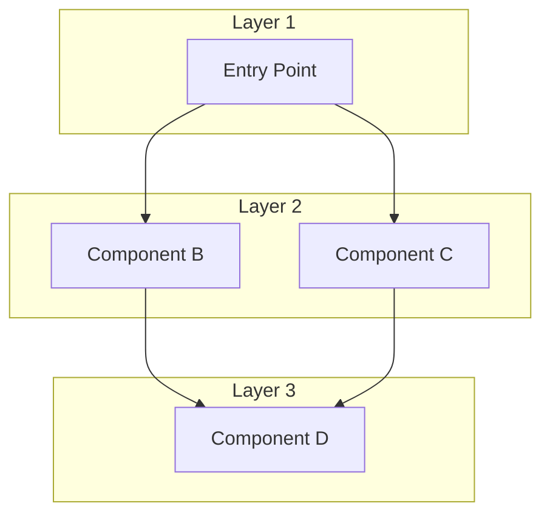

# Beginner Guide Template

# Engine Name — Beginner's Learning Guide

## What Is This Engine?

[2-3 sentences describing the codebase]
[Brief list of key features]

**Requirements:** [Hardware/software requirements]

---

## Mental Map — How the System Thinks

---

## Directory Map

| Folder | What It Means | Beginner Relevance |
|--------|--------------|-------------------|
| `source/core/` | Description | Low/Medium/High |
| `source/gfx/` | Description | Low/Medium/High |

---

## Class Curriculum

| Class | Topic | Time | Core Takeaway |
|-------|-------|------|---------------|
| 1 | Topic 1 | ~1 hr | One-liner |
| 2 | Topic 2 | ~1 hr | One-liner |
| 3 | Topic 3 | ~1 hr | One-liner |
| 4 | Topic 4 | ~1 hr | One-liner |
| 5 | Topic 5 | ~1 hr | One-liner |
| 6 | Topic 6 | ~1 hr | One-liner |

---

## Prerequisites

Before starting, students should understand:

| Topic | What to Google | Expected Understanding |
|-------|---------------|------------------------|
| Topic A | "search term" | What they should know |
| Topic B | "search term" | What they should know |
