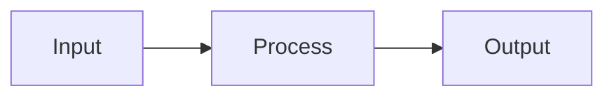

# Class Notes Template

# Class N: Title
## Goal: Understand what after ~1 hour of study

---

## Files to Read (in order)

**1. `source/path/file.h`** — Brief description
- Key points about this file
- What to look for: method names, patterns

**2. `source/path/another.h`** — Brief description
- Key points

### Key Concept: Name

## English Poem

[Write a 4-8 line poem explaining the concept in simple terms]

## 中文口诀

[Write a Chinese mnemonic verse with 4-8 lines]

## Visual Diagram

### Another Key Concept: <Name>

## English Poem

...

## 中文口诀

...

---

## Exercise (15 min)

1. Open `source/path/file.h`
2. [Action item]
3. [Action item]
4. [Action item]

---

## Mental Check

- [ ] Can you explain what <concept> does in one sentence?
- [ ] What is the relationship between <A> and <B>?
- [ ] Name 3 key methods in <file.h>
- [ ] What would happen if you <scenario>?

---

## Key Takeaways

| Concept | One-line explanation |
|---------|---------------------|
| <Concept A> | <Explanation> |
| <Concept B> | <Explanation> |
