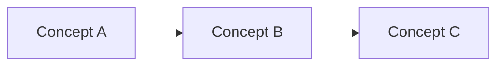

# Key Concept Poem Template

# Key Concept: Concept Name
# 关键概念：中文名称

---

## English Poem

[Write a 4-8 line poem explaining the concept in simple terms]

## 中文口诀

[Write a Chinese mnemonic verse with 4-8 lines]

## Visual Diagram



---

## Quick Reference

| Question | Answer |
|----------|--------|
| What is it? | One-line definition |
| Why does it matter? | Importance |
| Key methods/types? | List |
| Where is it used? | Common locations |

---

## Code Example (if applicable)

```cpp
// Example usage
IGfxDevice* pDevice = ...;
pDevice->CreateBuffer(desc, "name");
```

---

## One-Line Summary

> **"English: One sentence that captures it"**
> **"中文：中文一句话总结"**
